# Droplet Drug Detector

[](https://opensource.org/licenses/MIT)
[](https://www.python.org/downloads/release/python-310/)
[](https://github.com/adamsiemaszkiewicz/droplet-drug-detector/commits/main)

---

## TL;DR (Too Long; Didn't Read)

**Droplet Drug Detector (DDD)** 💊🔬🧠 is an innovative machine learning project focused on analyzing high-resolution microscopic images of dried droplets for pharmaceutical analysis. This project aims to revolutionize substance identification and quantification in drug analysis and quality control.

- **Objective** 🎯: Utilize advanced ML techniques for substance classification, concentration estimation, and rare substance detection in pharmaceuticals.
- **Dataset** 🔬: High-resolution microscopic images of various substances in different concentrations.
- **Key Features** 📃:
  - **Substance Classification** 💊: Using CNNs and Vision Transformers for pattern recognition in dried droplet images.
  - **Concentration Estimation** 📈: Developing regression models for accurate concentration levels measurement (future work).
  - **Rare Substance Detection** 🔍: Employing Siamese network-based methods (future work).
- **Technologies** 💻: Python 3.10, Pytorch + Pytorch Lightning, Azure DevOps, Azure Machine Learning.
- **Current Status** 🚀: Substance classification model shows high accuracy (F1-score: 0.9933) and robust performance. Concentration estimation and rare substance detection are planned future expansions.
- **Contributors** 👥: Tomasz Urbaniak, PhD; Adam Siemaszkiewicz (myself), MSc; Nicole Cutajar, MSc.

For detailed information on installation, development practices, and the project's structure, refer to the corresponding sections in this README.

---

## Table of Contents
0. [Table of Contents](#table-of-contents)
1. [Project Overview](#project-overview)
    - [Research Objective](#research-objective)
    - [Dataset](#dataset)
    - [Analysis Goals](#analysis-goals)
    - [Substance Classification](#substance-classification) (work in progress)
    - [Concentration Estimation](#concentration-estimation) (future work)
    - [Rare Substance Detection](#rare-substance-detection) (future work)
    - [Authors & Contributors](#authors--contributors)


2. [Installation](#installation)
3. [Repository Structure](#repository-structure)
4. [Development](#development)
5. [Configuration](#configuration)
6. [License](#license)

---

## Project overview

### Research objective
The Droplet Drug Detector (DDD) project aims to revolutionize pharmaceutical analysis by using advanced machine learning to analyze high-resolution microscopic images of dried droplets. This cutting-edge approach is designed to improve the identification and quantification of substances, thereby enhancing drug analysis and quality control.

### Dataset
The dataset comprises high-resolution microscopic images of various droplet samples, with each droplet being a few microliters in volume. Approximately 2000 images of substance droplets of different concentrations were captured under controlled conditions to ensure data consistency and reliability. The dataset includes images of the following substances:
- gelatin capsules,
- lactose,
- methyl-cellulose,
- naproxen,
- pearlitol
- polyvinyl-alcohol.

Future expansions of the dataset will include images of droplets containing mixtures of these substances.

#### Theoretical basis
This project is based on the study of patterns formed in dried droplets, commonly referred to as the 'coffee ring effect'. These patterns are influenced by the substance's physical and chemical properties, concentration, and interaction within the mixture, providing valuable information for substance analysis.

#### Sample collection
Images are captured under strictly controlled conditions to guarantee data consistency and reliability. However, slight imperfections and variations are intentionally included to ensure the model's robustness in less controlled environments.

<table>
  <tr>
    <td align="center"><em>Lactose, 0.25 mg/ml</em></td>
    <td align="center"><em>Methyl Celulose, 1 mg/ml</em></td>
    <td align="center"><em>Gelatin Capsule, 1 mg/ml</em></td>
  </tr>
  <tr>
    <td>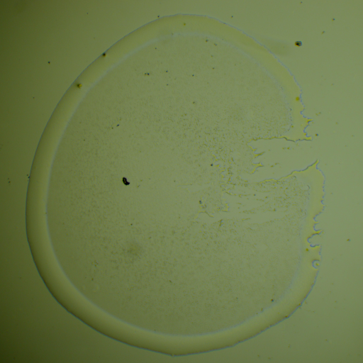</td>
    <td>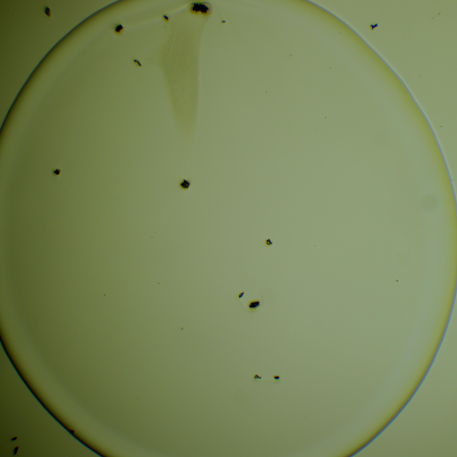</td>
    <td>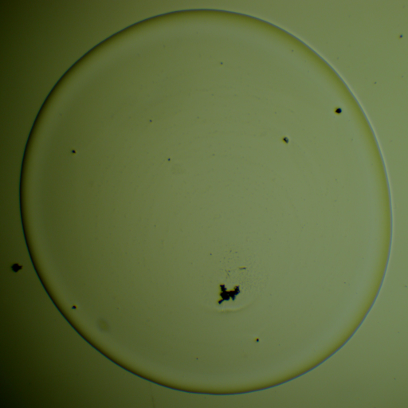</td>
  </tr>
</table>

### Analysis goals

1. **Single-Substance Classification**: Develop a model to classify individual substances based on the patterns in dried droplet images.
2. **Multiple-Substance Classification**: Extend the model to classify mixtures of substances, addressing the added complexity of inter-substance interactions.
2. **Concentration Estimation**: Design and implement regression models to accurately estimate the concentration levels of the substances. We aim to introduce novel methodologies in this area.
3. **Rare Substance Detection**: Develop a Siamese network-based approach for identifying rare substances. This network will be trained on existing data, emphasizing its utility in scenarios with limited sample availability.

### Single-Substance Classification

(Work in progress)

#### Model Training
A few experiments were conducted to determine a baseline model and hyperparameters for further experiments.

- **Epochs**: 50 (max), with early stopping implemented to prevent overfitting.
- **Data Split**: Stratified split (10:10:80 for training, validation & test subsets) across substances and concentration levels.
- **Preprocessing**: Normalization, resizing to 256x256 pixels.
- **Data Augmentation**: Color jitter, random gaussian noise, mirroring, and rotation.
- **Model Architecture**: ResNet18.
- **Loss Function**: Cross-entropy.
- **Optimizer**: Adam with a constant learning rate of 3e-4.

<table>
  <tr>
    <td align="center"><em>Learning curves (Cross Entropy)</em></td>
    <td align="center"><em>Learning curves (F1 score)</em></td>
  </tr>
  <tr>
    <td>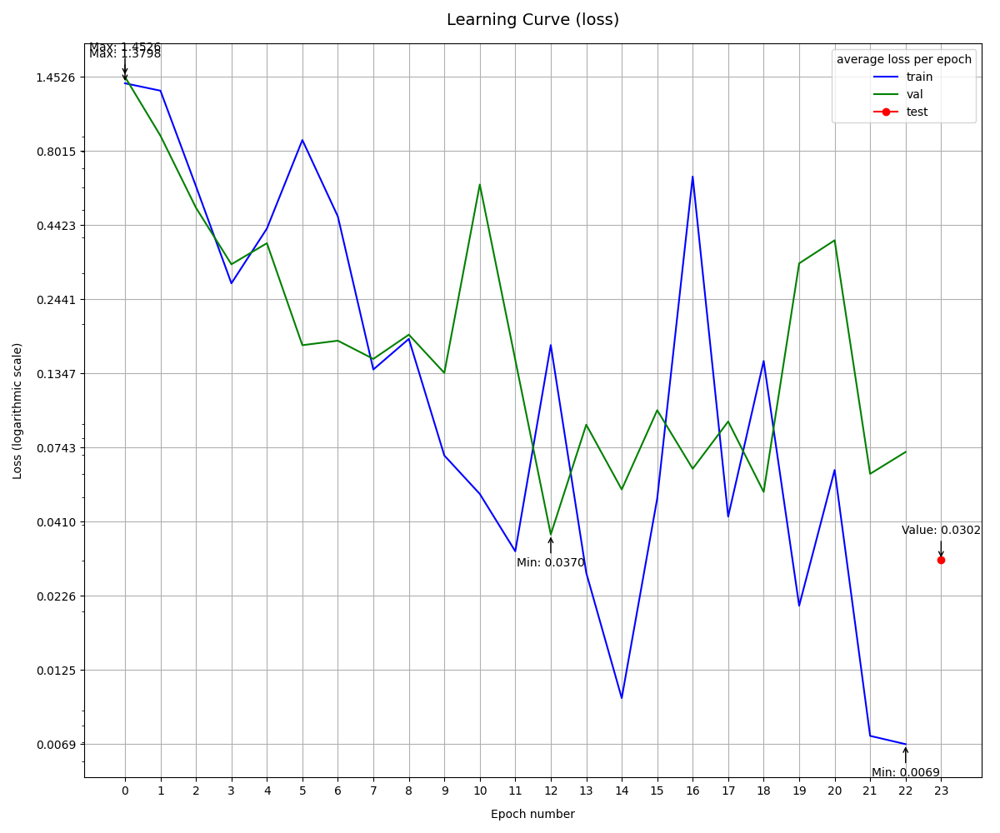</td>
    <td>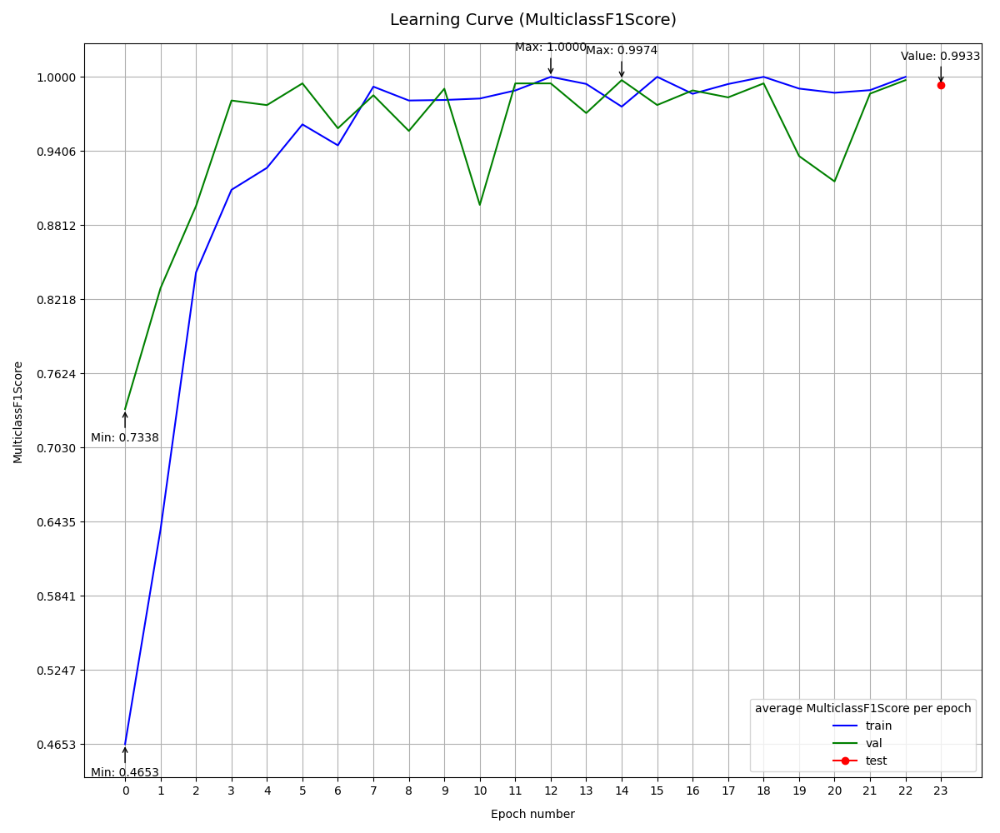</td>
  </tr>
</table>

#### Model Evaluation
- **Metrics**: Accuracy, precision, recall and F1 score.
- **Results**: Our initial experiments yielded a very high F1-score (**0.9933**) on the **test set**, indicating robust model performance.

| Experiment      | Accuracy   | Precision   | Recall   | F1 score   |
|-----------------|------------|-------------|----------|------------|
| Base experiment | 0.993292   | 0.993328    | 0.993292 | 0.993297   |
| coming soon     | -          | -           | -        | -          |

<table>
  <tr>
    <td align="center"><em>Confusion matrix (best validation epoch)</em></td>
    <td align="center"><em>Confusion matrix (test set)</em></td>
  </tr>
  <tr>
    <td>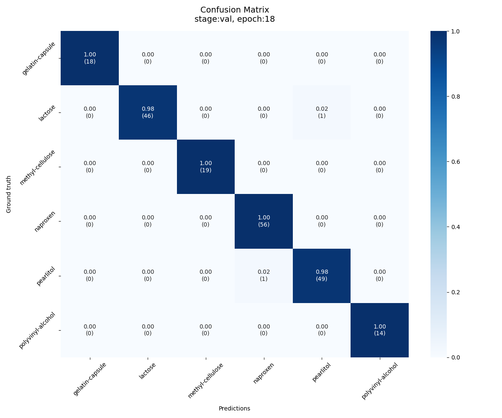</td>
    <td>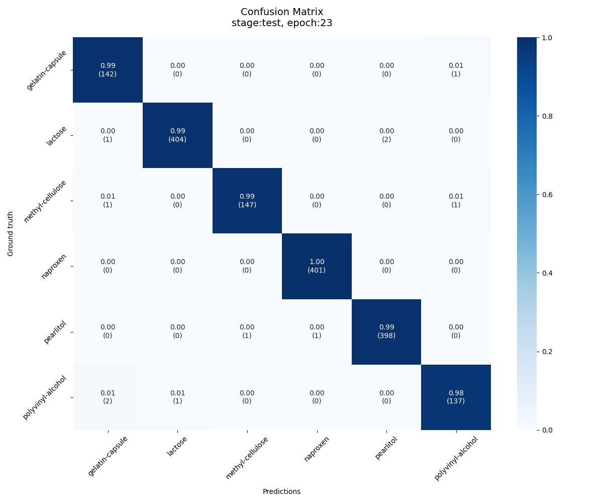</td>
  </tr>
</table>


#### Explainability
- **Misclassification Analysis**: Images with high loss values are analyzed and stored for further examination.

<table>
  <tr>
    <td align="center"><em>True: gelatin-capsule, Predicted: polyvinyl-alcohol</em></td>
    <td align="center"><em>True: gelatin-capsule, Predicted: polyvinyl-alcohol</em></td>
    <td align="center"><em>True: methyl-cellulose, Predicted: polyvinyl-alcohol</em></td>
  </tr>
  <tr>
    <td></td>
    <td></td>
    <td></td>
  </tr>
</table>

- **Class Activation Mapping (CAM)**: Used to visualize significant regions in the images for making predictions.

<table>
  <tr>
    <td align="center"><em>Test sample 0</em></td>
    <td align="center"><em>Test sample 40</em></td>
    <td align="center"><em>Test sample 60</em></td>
  </tr>
  <tr>
    <td>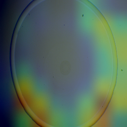</td>
    <td>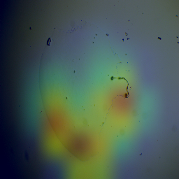</td>
    <td>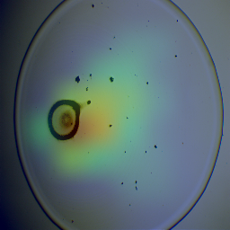</td>
  </tr>
</table>


- **Activation Feature Analysis**: Analyzing how different layers of the network process the input images, to gain insights into the model's internal workings.

<table>
  <tr>
    <td align="center"><em>Layer 1</em></td>
    <td align="center"><em>Layer 2</em></td>
    <td align="center"><em>Layer 3</em></td>
    <td align="center"><em>Layer 4</em></td>
  </tr>
  <tr>
    <td>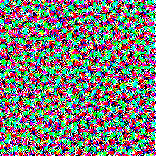</td>
    <td>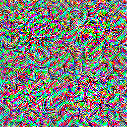</td>
    <td>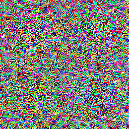</td>
    <td>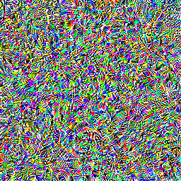</td>
  </tr>
</table>

### Multiple-Substance Classification
(To be added) This section will discuss the challenges associated with classifying mixtures of substances and our approach to addressing them.

### Concentration Estimation
(Work in progress)

#### Model Training

To achieve precise concentration level measurement, we trained a regression model using the following specifications:


- **Epochs**: 100 (max), with early stopping implemented to prevent overfitting.
- **Data Split**: Stratified split (10:10:80 for training, validation & test subsets) across substances and concentration levels.
- **Preprocessing**: Similar to the classification task, including normalization and resizing.
- **Data Augmentation**: Color jitter, random gaussian noise, mirroring, and rotation.
- **Model Architecture**: ResNet18.
- **Loss Function**: Mean Squared Error (MSE).
- **Optimizer**: Adam with a constant learning rate of 3e-4.

<table>
  <tr>
    <td align="center"><em>Learning curves (MSE)</em></td>
    <td align="center"><em>Learning curves (R² Score)</em></td>
  </tr>
  <tr>
    <td>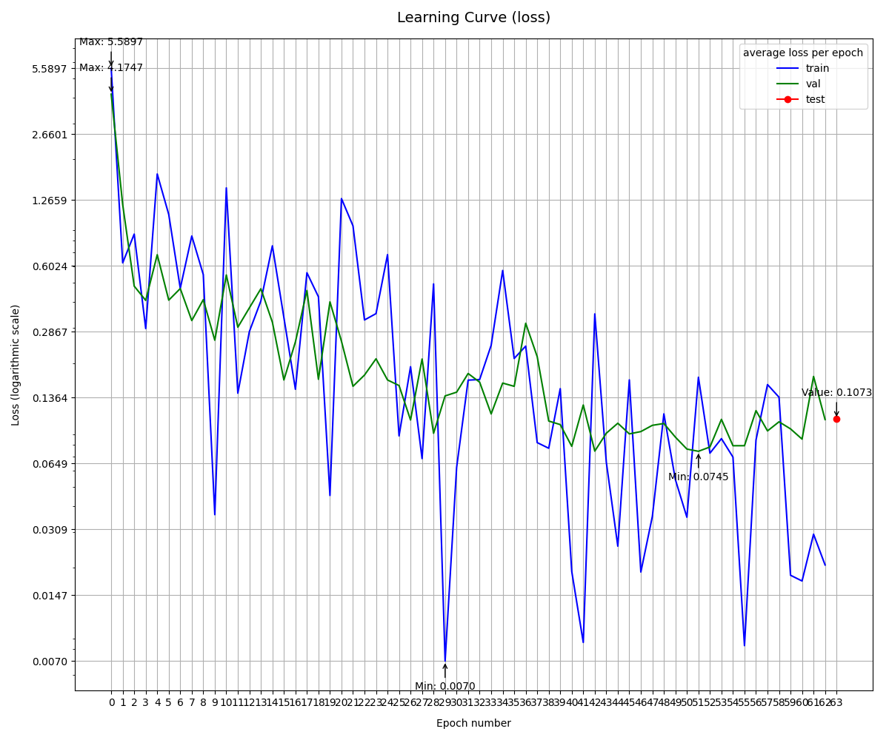</td>
    <td>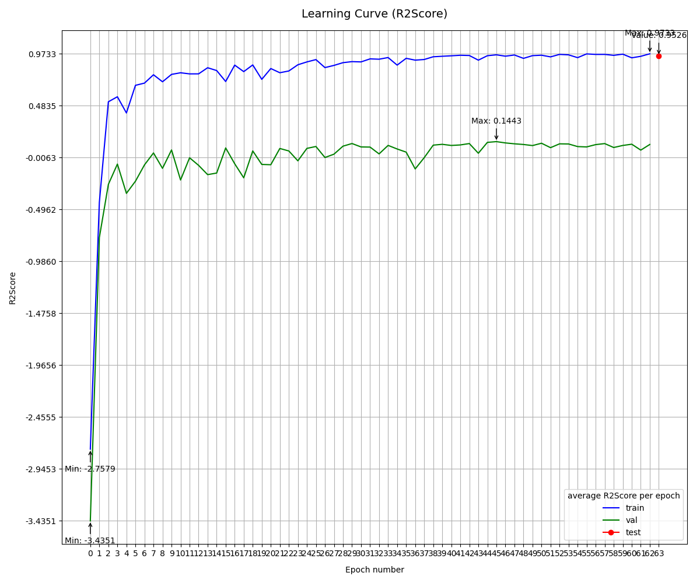</td>
  </tr>
</table>

#### Model Evaluation

The model's performance was evaluated on a hold-out test set, separate from the training and validation sets. The following metrics were used:

- **R² (Coefficient of Determination)**: Measures the proportion of the variance in the dependent variable that is predictable from the independent variable(s). For this model, we achieved an R² score of **0.9526** on the test set.
- **Mean Squared Error (MSE)**: Measures the average of the squares of the errors — that is, the average squared difference between the estimated values and the actual value. The model achieved an MSE of **0.1073** on the test set.

These metrics indicate the model's high accuracy and precision in estimating substance concentrations.

| Experiment      | MSE      | R²   |
|-----------------|----------|------|
| Base experiment | 0.1073 | 0.9526 |
| coming soon     | -        | -    |


### Rare Substance Detection
(To be added) This section will discuss the use of Siamese networks for detecting rare substances and the unique challenges associated with limited sample sizes.

### Authors & Contributors
- **Tomasz Urbaniak, PhD** _(Wrocław Medical Univesity)_

A pharmaceutical expert, Tomasz is the co-author responsible for guiding the project's pharmaceutical aspects, leveraging his extensive knowledge in the field.
- **Adam Siemaszkiewicz, MSc** (myself) _(Wrocław University of Science & Technology)_

As a co-author, I specialize in machine learning, data science, and software engineering, driving the technical and analytical facets of the project.
- **Nicole Cutajar, MSc** _(University of Malta)_

A vital contributor focusing on sample collection and image acquisition, ensuring the integrity and quality of our dataset.


[Back to the top](#droplet-drug-detector)

---

## Installation

Before installing the project, ensure that you have the following requirements:

- Python 3.10
- Mamba (for faster and more efficient virtual environments)
- Docker (optional, needed for containerization)
- Git (for version control)

Follow these steps to set up your local environment:

1. **Clone the repository** to your local machine:

    ```bash
    git clone [repository-url]
    cd [repository-name]
    ```

2. **Install Mamba**: If you do not have Mamba installed, you can install it through Conda:

    ```bash
    conda install mamba -n base -c conda-forge
    ```

3. **Create and activate a Conda environment**: Use the provided environment YAML files to create and activate your Conda environment:

    ```bash
    mamba env create -f environments/[environment-name].yaml
    conda activate [environment-name]
    ```

5. **Set up pre-commit hooks** to enforce a variety of standards and validations during each commit:

    ```bash
    pre-commit install
    ```

    To run all pre-commit hooks on all files in the repository, execute:

    ```bash
    pre-commit run --all-files
    ```

6. **Docker setup** (optional): For projects that require Docker, build and run your containers using:

    ```bash
    docker build -t [image-name]:[tag] .
    docker run -it [image-name]:[tag]
    ```

[Back to the top](#droplet-drug-detector)

---

## Repository Structure

### Azure DevOps

The `.azure-devops` directory contains configurations specific to Azure DevOps features and services to support the project's development workflow.

### Github

The `.github` directory contains configurations specific to GitHub features and services to support the project's development workflow.

### Artifacts

All experiment related artifacts such as configuration files, model checkpoints, logs, etc. are saved in `artifacts` directory.

### Configs

The `configs` directory contains configuration YAML files for different machine learning tasks.

### Data

Store all project related data inside `data` folder.


### Docker

All Docker-related files necessary for building Docker images and managing Docker containers for the project are located in `docker` directory.

### Environments

The `environments` directory stores YAML files that define the different Conda environments needed for the project.

### Notebooks

Jupyter notebooks integral to the project as located in `notebooks` directory..

### Source Code

The `src` directory contains all source code for the project.

### Testing

The `tests` directory contains various types of automated tests to ensure the codebase works correctly:

- `tests/unit` for unit tests to validate individual pieces of code independently.
- `tests/integration` for integration tests to ensure different code sections work together as intended.
- `tests/e2e` for end-to-end tests that verify complete user workflows.


#### Running Tests

Execute all tests with:

```bash
pytest
```

[Back to the top](#project-title)

---

## Development

### Azure DevOps Code Structure

A detailed explanation of the layout and purpose of the `.azure-devops` directory contents.

- `.azure-devops/pipelines`: This folder holds the YAML pipeline definitions for building and deploying using Azure DevOps services.
  - `build-aml-environment.yaml` sets up Azure Machine Learning environment needed for running Azure ML tasks
  - `droplet-drug-classificator-training.yaml` runs the Droplet Drug Classificator training pipeline as Azure Machine Learning task

- `.azure-devops/templates`: Reusable YAML templates with encapsulated functionalities to streamline pipeline creation. The templates include:
  - `configure-aml-extension.yaml` for setting up Azure ML extensions.
  - `connect-to-aml-workspace.yaml` for connecting to an Azure ML workspace within the pipeline.
  - `create-conda-env.yaml` for constructing Conda environments needed for the pipeline's operations.
  - `install-azure-cli.yaml` for installing the Azure CLI.
  - `substitute-env-vars.yaml` for injecting environment variables dynamically into the pipeline process.


### Source Code Structure

A detailed explanation of the layout and purpose of the `src` directory contents.

- `aml`: Azure Machine Learning utilities, components and pipelines.
    - `components`: Contains code for individual Azure Machine Learning components.
        - `classificator_training`: A component meant for classification model training & evaluation with its specification YAML, entrypoints script, options, configuration and custom functions.
    - `pipelines`: Contains code for Azure Machine Learning pipelines.
        - `classificator_training`: A pipeline running classification component containing its specification YAML
    - `blob_storage.py`: Azure Blob Storage service allowing to upload and download files and folders.
    - `build_aml_environment.py`: A script to set up the Azure Machine Learning environment.
    - `client.py`: Azure Machine Learning client allowing to interact with AML objects.
    - `environment.py`: Azure Machine Learning environment allowing to create and manage AML environments.

- `common`: Shared utilities and constants used across the project.
    - `consts`: Definitions of constants used throughout the codebase, like Azure-specific constants, directory paths, and extensions.
    - `settings`: Infrasturcture settings storing things such as Azure ML, Azure Blob Storage, cluster & database credentials.
    - `utils`: General utility functions and classes, such as settings management, logging, converters and validators.
- `configs`: Configuration classes for machine learning tasks.
- `machine_learning`: Contains code for machine learning tasks divided into different categories and providing types, configuration and creation..
    - `augmentations`: Data augmentation
    - `callbacks`: Pytorch Lightning training callbacks
    - `classification`: Classification-specific modules
      - `loss_functions`: Loss functions
      - `metrics`: Evaluation metrics
      - `models`: Model architectures
      - `module.py`: Pytorch Lightning module
    - `loggers`: Pytorch Lightning loggers
    - `optimizer`: Optimizer
    - `preprocessing`: Data preprocessing transformations
    - `scheduler`: Learning rate scheduler
    - `trainer`: Pytorch Lightning trainer

[Back to the top](#project-title)

---

## Configuration

### GitHub Configuration

The `.github` directory contains configurations specific to GitHub features and services to support the project's development workflow.

#### GitHub Actions Workflows

- `workflows`: Includes automation workflows for GitHub Actions. The `ci.yaml` file in this directory configures the continuous integration workflow, which is triggered on push and pull request events to run tests, perform linting, and other checks integral to maintaining code quality and operational integrity.

#### Issue and Pull Request Templates

- `ISSUE_TEMPLATE`: Provides templates for opening new issues on GitHub. The templates ensure that all necessary details are included when contributors report bugs (`bug_report.md`) or propose new features (`feature_request.md`). Use these templates to create issues that are consistent and informative.

### Docker Configuration

The `docker` directory is intended to house all Docker-related files necessary for building Docker images and managing Docker containers for the project. This includes:

- **Dockerfiles**: Each Dockerfile contains a set of instructions to assemble a Docker image. Dockerfiles should be named with the convention `Dockerfile` or `Dockerfile.<environment>` to denote different setups, such as development, testing, or production environments.

- **docker-compose files**: For projects that run multiple containers that need to work together, `docker-compose.yml` files define and run multi-container Docker applications. With Compose, you use a YAML file to configure your application's services and create and start all the services from your configuration with a single command.

- **Configuration Scripts**: Any scripts that aid in setting up, building, or deploying Docker containers, such as initialization scripts or entrypoint scripts, belong here.

- **Environment Files**: `.env` files that contain environment variables necessary for Docker to run or for Dockerized applications to operate correctly can be placed in this directory. These files should not contain sensitive information and should be excluded from version control if they do.

As the project develops, ensure that you populate the `docker` directory with these files and provide documentation on their purpose and how they should be used. This could include instructions on how to build images, start containers, and manage containerized environments effectively.

### Environment Configuration

The `environments` directory contains configuration files that define the different environments needed for the project. These files are essential for ensuring that the project runs with the correct versions of its dependencies and in a way that's consistent across different setups.

- **Conda Environment Files**: YAML files that specify the packages required for a conda environment. Environment YAML files should have the same name as the project they relate to.

- **Infrastructure Configuration**: The `infra.yaml` file might include configurations for setting up the infrastructure as a code, which can be particularly useful when working with cloud services or when you want to automate the setup of your project's infrastructure.

### Formatting, Linting & Type Checking

The pre-commit hooks will now automatically check each file when you attempt to commit them to your git repository. If any hooks make changes or fail, fix the issues, and try committing again.

Here are the hooks configured for this project:

- `flake8`: Lints Python source files for coding standard violations, complexity, and style issues.
- `black`: Formats Python code to ensure consistent styling.
- `isort`: Sorts Python imports alphabetically within respective sections and by type.
- `mypy`: Checks type hints and enforces type checking on your code.
- `pytest`: Runs automated tests to make sure new changes do not break the functionality.

[Back to the top](#droplet-drug-detector)

---

## License

This project is licensed under the MIT License - see the [LICENSE.md](LICENSE.md) file for details.

[Back to the top](#droplet-drug-detector)
